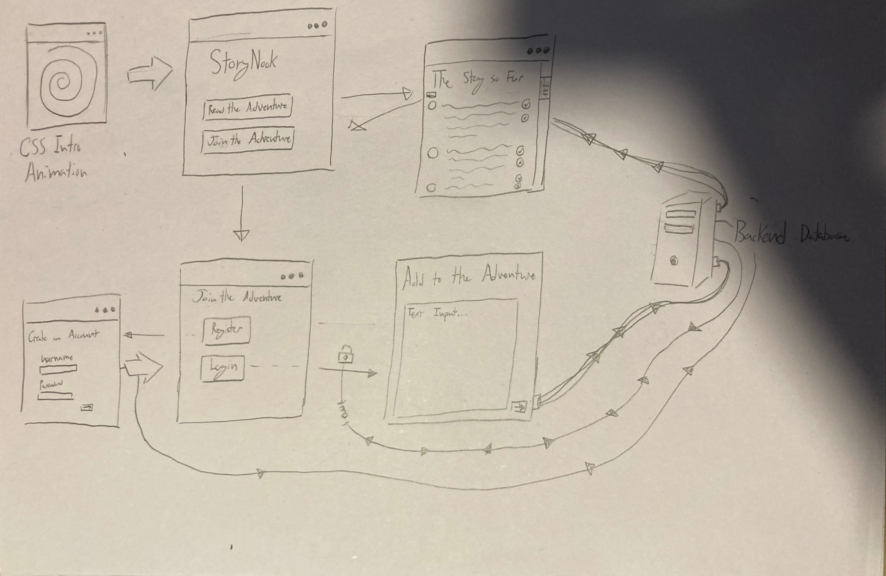

# StoryNook

[My Notes](notes.md)

My application is a website that allows anyong to contribute their own writing to a community writing project. 

> [!NOTE]
>  This is a template for your startup application. You must modify this `README.md` file for each phase of your development. You only need to fill in the section for each deliverable when that deliverable is submitted in Canvas. Without completing the section for a deliverable, the TA will not know what to look for when grading your submission. Feel free to add additional information to each deliverable description, but make sure you at least have the list of rubric items and a description of what you did for each item.

> [!NOTE]
>  If you are not familiar with Markdown then you should review the [documentation](https://docs.github.com/en/get-started/writing-on-github/getting-started-with-writing-and-formatting-on-github/basic-writing-and-formatting-syntax) before continuing.

## 🚀 Specification Deliverable

> [!NOTE]
>  Fill in this sections as the submission artifact for this deliverable. You can refer to this [example](https://github.com/webprogramming260/startup-example/blob/main/README.md) for inspiration.

For this deliverable I did the following. I checked the box `[x]` and added a description for things I completed.

- [`[x]` ] Proper use of Markdown -Added an image and text
- [`[x]` ] A concise and compelling elevator pitch -Added a short elevator pitch
- [`[x]` ] Description of key features -Added descriptions for key features
- [`[x]` ] Description of how you will use each technology -Added descriptions for how I will use the technologys
- [`[x]` ] One or more rough sketches of your application. Images must be embedded in this file using Markdown image references. -Added a rough sketch of my application

### Elevator pitch

So many people have so many great ideas just waiting to be put into words, and the StoryKnook allows you to pool those brilliant ideas with everyone else in a collaborative storytelling project. Users can submit their own writing to add to a community story. 

### Design

The above image shows a map of how users can navigate the webpage. 

### Key features

- Users can read the community story
- Users can sign in to add to the story
- Persistent user-generated text

### Technologies

I am going to use the required technologies in the following ways.

- **HTML** - Used to determine were crucial elements of the webpage will be place
- **CSS** - Used to animate how the webpage looks
- **React** - Used to accept external input to add to the story
- **Service** - Used to login to add to the story
- **DB/Login** - Used to determine who can access the website, and store whats written of the story
- **WebSocket** - Used to update the story for users

## 🚀 AWS deliverable

For this deliverable I did the following. I checked the box `[x]` and added a description for things I completed.

- [X] **Server deployed and accessible with custom domain name** - [My server link](https://startup.storynook.click).

## 🚀 HTML deliverable

For this deliverable I did the following. I checked the box `[x]` and added a description for things I completed.

- [X] **HTML pages** - Added 4 different HTML pages
- [X] **Proper HTML element usage** - Pages are structured with HTML elements
- [X] **Links** - Every page has links to navigate the website
- [X] **Text** - Text gives instructions on how to use the website
- [X] **3rd party API placeholder** - Added a placeholder for a 3rd party API
- [X] **Images** - Added images of books
- [X] **Login placeholder** - Added a login placeholder
- [X] **DB data placeholder** - Added a DB data placeholder
- [X] **WebSocket placeholder** - Added A websocket placeholder 

## 🚀 CSS deliverable

For this deliverable I did the following. I checked the box `[x]` and added a description for things I completed.

- [X] **Header, footer, and main content body** - Header has been stylzed, now has color and fonts.
- [X] **Navigation elements** - Navigation elements now change color when you hover over them, and use flex to all be on the same line. 
- [X] **Responsive to window resizing** - Flex is used to position elements.
- [X] **Application elements** - Elements all have colors, buttons and inputs use Bootstrap.
- [X] **Application text content** - Some of the text has different fonts and sizes.
- [X] **Application images** - The image on the website has a shadow behind it, and rounded edges. 

## 🚀 React part 1: Routing deliverable

For this deliverable I did the following. I checked the box `[x]` and added a description for things I completed.

- [x] **Bundled using Vite** - Vite has been added.
- [x] **Components** - Components have been ported to work with react.
- [x] **Router** - Elements of the website route the user correctly.

## 🚀 React part 2: Reactivity deliverable

For this deliverable I did the following. I checked the box `[x]` and added a description for things I completed.

- [x] **All functionality implemented or mocked out** - User input for "The Adventure" works using React. 
- [x] **Hooks** - Hooks used to store and retrieve login information and story information. 

## 🚀 Service deliverable

For this deliverable I did the following. I checked the box `[x]` and added a description for things I completed.

- [ ] **Node.js/Express HTTP service** - I did not complete this part of the deliverable.
- [ ] **Static middleware for frontend** - I did not complete this part of the deliverable.
- [ ] **Calls to third party endpoints** - I did not complete this part of the deliverable.
- [ ] **Backend service endpoints** - I did not complete this part of the deliverable.
- [ ] **Frontend calls service endpoints** - I did not complete this part of the deliverable.
- [ ] **Supports registration, login, logout, and restricted endpoint** - I did not complete this part of the deliverable.

## 🚀 DB deliverable

For this deliverable I did the following. I checked the box `[x]` and added a description for things I completed.

- [ ] **Stores data in MongoDB** - I did not complete this part of the deliverable.
- [ ] **Stores credentials in MongoDB** - I did not complete this part of the deliverable.

## 🚀 WebSocket deliverable

For this deliverable I did the following. I checked the box `[x]` and added a description for things I completed.

- [ ] **Backend listens for WebSocket connection** - I did not complete this part of the deliverable.
- [ ] **Frontend makes WebSocket connection** - I did not complete this part of the deliverable.
- [ ] **Data sent over WebSocket connection** - I did not complete this part of the deliverable.
- [ ] **WebSocket data displayed** - I did not complete this part of the deliverable.
- [ ] **Application is fully functional** - I did not complete this part of the deliverable.
